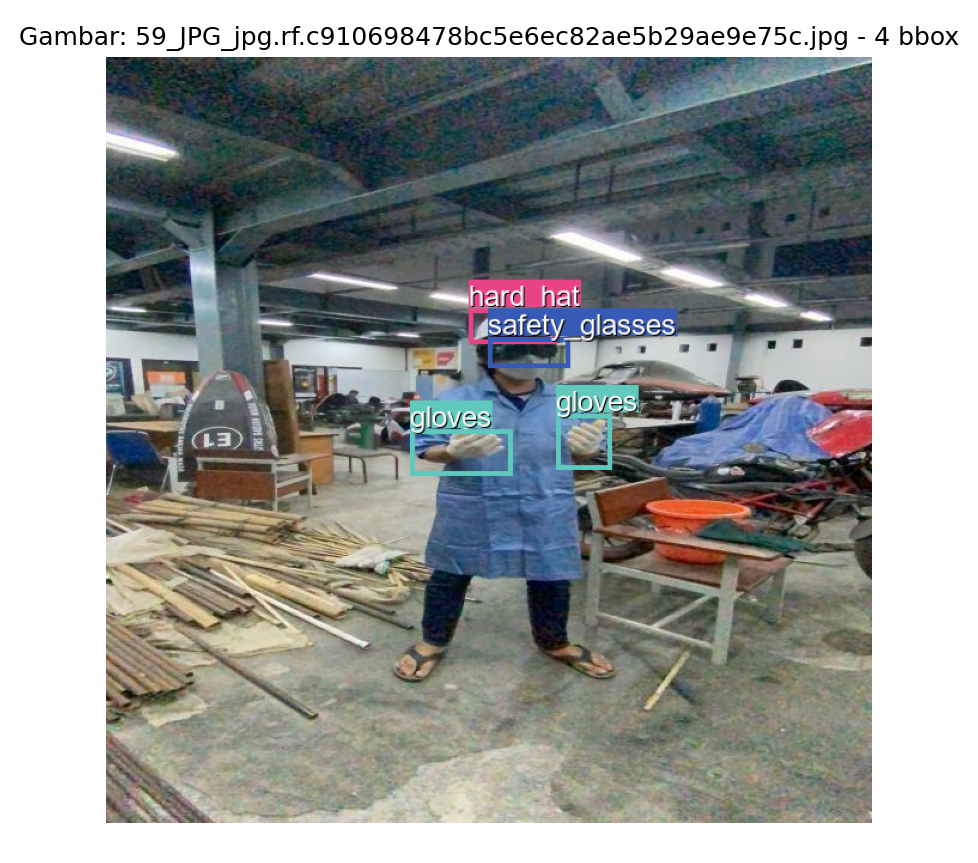

# ML Data Engineer Challenge – PPE Detection

## Checklist Progress

- [Done] Skema Labeling dan Pertimbangan
- [Done] Panduan Anotasi
- [Done] Dataset gambar tanpa anotasi
- [Done] Dataset gambar dengan anotasi (COCO)
- [Done] Script preview dataset dengan bounding box
- [Done] Dataset summary statistik
- [Done] Dokumentasi README

---

## Cara Instalasi dan Menjalankan Preview Dataset

1. **Clone atau download repository ini**
2. **Install dependencies**

   ```bash
   pip install -r requirements.txt
   ```

3. **Jalankan script preview**
   Masuk ke folder Challenge3:

   ```bash
   cd Challenge3
   python preview_dataset.py
   ```

Berikut contoh hasil preview dataset beserta bounding box dan label:



---

## Format Dataset

- **Format dataset:** COCO (Common Objects in Context)
- **Tool anotasi:** Roboflow, dimana semua anotasi bounding box diekspor dalam format COCO dari Roboflow.

---
